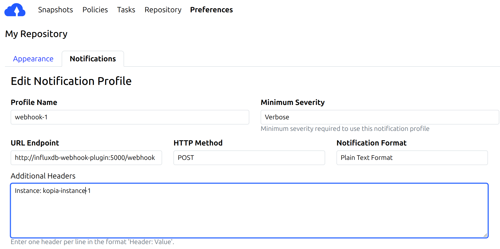

# Kopia Webhook to InfluxDB Listener

This service listens for webhook notifications from multiple [Kopia](https://kopia.io) backup repositories and forwards parsed snapshot metrics to an InfluxDB instance. It is designed for observability of Kopia operations, especially useful when monitoring backup success, size, duration, and error rates in dashboards like Grafana.

---

## 🔧 Features

- Listens for HTTP POST requests from Kopia webhooks
- Parses non-JSON raw text body content
- Extracts:
  - Snapshot `status`
  - `start time`, `duration`, `size`
  - Number of `files`, `directories`
  - `error` message (on failure)
- Pushes structured measurements to InfluxDB
- Adds metadata via tags:
  - `instance`: Kopia instance name (via HTTP header)
  - `host`: HTTP Host header
  - `client_ip`: Remote IP address of sender

---

## 🚀 Quick Start

### 1. Configure service
Create a new service to your docker compose file
```yaml
services:
  influxdb-webhook-plugin:
    image: abrahampm/kopia-influxdb-plugin:latest
    ports:
      - "5000:5000"
    env_file:
      - .env
    restart: unless-stopped
```

### 2. Create a `.env` file

```env
# .env
INFLUXDB_URL=http://influxdb:8086
INFLUXDB_TOKEN=your-token-here
INFLUXDB_ORG=your-org
INFLUXDB_BUCKET=kopia_metrics
INSTANCE_NAME=kopia-listener
```

### 3. Launch with Docker Compose

```bash
docker compose up -d
```

This starts the listener on port `5000`.

---

## 4. Configure Kopia webhook

Each Kopia instance can send notifications to influxdb using webhook. You must manually configure this in you Kopia preferences.


The `Instance` header is used to tag metrics per repository instance in InfluxDB.

---


## 📊 InfluxDB Measurements

### Measurement Types:

* `kopia_test_notification`: Received when Kopia sends test messages
* `kopia_snapshot`: Sent when a real snapshot completes (success or failure)

### Tags:

* `instance`: Name of the Kopia instance
* `host`: HTTP Host header
* `client_ip`: IP address of the sender

### Fields (if available):

* `status`: `success`, `fatal`, etc.
* `start_time`: UTC timestamp of snapshot start
* `duration_ms`: Snapshot duration in milliseconds
* `size_bytes`: Size of snapshot
* `files`: Number of files
* `directories`: Number of directories
* `error`: Error message if failed

---

## 🛠 Development Usage

To run the app manually:

```bash
pip install -r requirements.txt
python app.py
```

To build and publish Docker image:

```bash
docker build -t yourusername/kopia-webhook-listener .
docker push yourusername/kopia-webhook-listener
```

---

## 📄 License

MIT License

